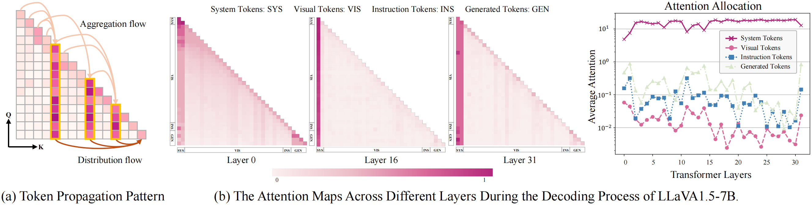
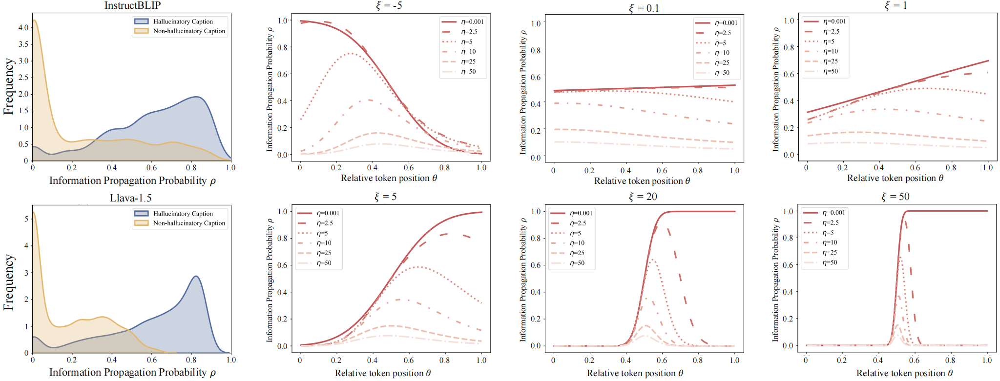

# Intervening Anchor Token: Decoding Strategy in Alleviating Hallucinations for MLLMs


## Overview


<p align="center"></p>

Multimodal large language models (MLLMs) offer a powerful mechanism for interpreting visual information. However, they often suffer from hallucinations, which impede the real-world usage of these models. Existing methods attempt to alleviate this issue by designing special decoding strategies that penalize the summary tokens. However, these methods lack analysis of the relationship between hallucination and the summarization mechanism of LLMs. Interestingly, we find that penalizing summary tokens is not necessary: merely intervening the query-key parameters variance, without costing extra inference time, still alleviates hallucinations. Specifically, we explore the causes of hallucinations by analyzing localized self-attention patterns called *“anchor” tokens* and define the attention localization degree of the model as *token propagation probabilities*. Our analysis reveals that over-propagation of anchor tokens occurs when the distribution of eigenvalues of the query and key matrices has a non-zero mean and a polarized variance, leading to excessive dependence on anchor tokens while neglecting vision information and describing the image content with hallucination. Based on this observation, we propose a versatile plug-and-play decoding strategy, *Dynamic **T**oken Prop**a**gation **Me**chanism* (**TAME**), to alleviate excessive propagation by dynamically intervening the eigenspectrum variance of the attention weight, thereby alleviating hallucinations without relying on complex decoding strategies. Extensive experiments reveal a correlation between the eigenspectrum and hallucinations across various MLLMs and show that TAME reduces the percentage of hallucinated objects.


<p align="center"></p>


## Setup
As we design the LVLMs decoding strategy, it is convenient to use ANTRP by installing our modified `transformers` package.
```
conda env create -f environment.yml
conda activate ANTRP
python -m pip install -e transformers
```
<!-- #### The implement of ANTRP are mainly in:
- `transformers/src/transformers/models/llama/modeling_llama.py`. -->

## Implementation
After setup the environment, you can directly use our code base to imply our ANTRP:


```
python pope_eval.py --pope-type coco_adversarial --model llava-1.5  --beam 5  --opera #OPERA

```

```
python pope_eval.py --pope-type coco_adversarial --model llava-1.5  --use-cd  --use-fast-v  --sample  --sample-greedy  #SID_greedy

```
```
python pope_eval.py --pope-type coco_adversarial --model llava-1.5  --use-vcd  --sample  --sample-greedy  #VCD_greedy

```
```
python pope_eval.py --pope-type coco_adversarial --model llava-1.5  --use-icd  --sample  --sample-greedy  #ICD_greedy

```
```
python pope_eval.py --pope-type coco_adversarial --model llava-1.5  --beam 5  #Beam Search

```

The CHAIR metric utilizes the same configuration.


## Evaluation

We provide extensive evaluation metrics including <b>GPT-4V</b> `eval_utils/gpt4v_eval.py` , <b>GPT4</b> `shr_eval.py`, <b>POPE</b> `pope_eval.py`, <b>CHAIR</b> `eval_utils/chair_eval.py`

The following evaluation requires for MSCOCO 2014 / Visual Genome dataset. For Visual Genome dataset, please download [here](https://cocodataset.org/#home)  `dataset/download_visual_genome_v1.2.py` and extract it in the data path.

Besides, it needs you to prepare the following checkpoints of 7B base models:

- Download [LLaVA-1.5 merged 7B model](https://huggingface.co/liuhaotian/llava-v1.5-7b) and specify it at `eval_configs/llava-1.5_eval.yaml`.
- Download [Vicuna 7B v1.1 model](https://github.com/lm-sys/FastChat) and specify it at `minigpt4/configs/models/blip2_instruct_vicuna7b.yaml`.
- Download [Shikra merged 7B model](https://github.com/shikras/shikra#checkpoint) and specify it at  `eval_configs/shikra_eval.yaml`.
- Download [MiniGPT-4 7B pretrained weights](https://drive.google.com/file/d/1RY9jV0dyqLX-o38LrumkKRh6Jtaop58R/view?usp=sharing) and specify it at [Line 8](https://github.com/shikiw/OPERA/blob/bf18aa9c409f28b31168b0f71ebf8457ae8063d5/eval_configs/minigpt4_eval.yaml#L8) of `eval_configs/minigpt4_eval.yaml`.

  
### Arguments

| Argument             | Example             | Description   |
| -------------------- | ------------------- | ------------- |
| `--model`    | `llava-1.5` | Specify the LVLM model. |
| `--data-path`     | `/path/to/dataset` | Path to the dataset file or folder. |
| `--pope-type`     | `coco_adversarial` | Type for POPE evaluation. |
| `--sample`        | `store_true` | Use the modified decoding strategy. |
| `--sample-greedy` | `store_true` | Use CD with sampling and greedy decoding. |
| `--beam`         | `5` | Beam search number. |
| `--opera`         | `store_true` | Use OPERA. |


## Acknowledgement
This repo is based on the LVLMs codebase of  [SID]([https://github.com/shikiw/OPERA](https://github.com/huofushuo/SID)), [OPERA](https://github.com/shikiw/OPERA), [VCD](https://github.com/DAMO-NLP-SG/VCD), and [HA-DPO](https://opendatalab.github.io/HA-DPO/) . Thanks for their excellent works!


